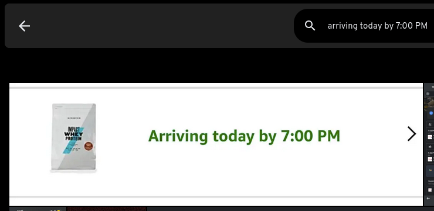

# An OCR Neural Net Model for a Media Gallery

##### This Project is a fork of [Immich](https://immich.app) which is a self-hosted media gallery with a centralised architecture

- Most of code was made/ changed with the help of immich's **outstanding** [documentation](https://immich.app/docs)

- **The submodule contains the AI model code ONLY, not the code changes, the code changes are in this repo**
---

# [My OCR Neural Network Model Writeup 👈](mywriteup.md)

#### TL;DR: Repository consists of my code which integrates other open pre-made models into immich

- Immich has support for a general AI image search, however it is lacking a text search, which is why I decided to implment OCR into Immich

## **Code Changes:**

- OCR Integration for both the web & mobile cross platform immich client (written in TypeScript & Svelte, Dart) respectively
  - Backend Client Code For:
    - Flutter Mobile Client
    - Web Client
  - Integrating the new database code & with the new backend
  - Frontend Code for
    - Web Client
      - The Admin Panel (OCR section)
    - Android Client
- Database code
- OCR
  - Integrated Multiple Established OCR models (i.e. Paddel OCR) & added bindings
- Image Preview: 

---
*This is a personal project which is not indented for prod*
