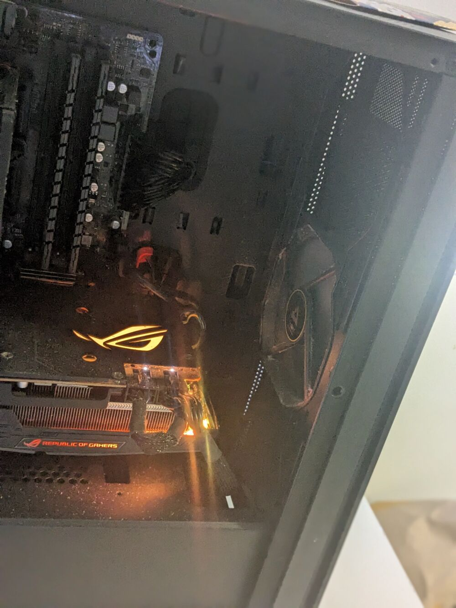

# OCR AI Model for Immich - My Writeup

#### A highly experimental AI training project based on novice research and tutorials

## TL;DR

- My goal was to: Build a custom OCR neural net for my media gallery
  - extract text from photos to make them searchable
- Tech Stack: PyTorch, Python 3
- 'Meta' Software & Hardware used:
  - AMD RX 5700 XT - EC2 was too expensive
  
  - Libvirt QEMU
    - GPU Passthru (used mental outlaw's [youtube](https://youtube.com/watch?v=KVDUs019IB8) guide, it can be used as an OS agnostic guide)

Mainly followed a tutorial on OCR model training

- Used (CR Neural Network) architecture
- Modified the data preprocessing for Immich-specific use cases

## How I Actually Built and Trained the Model

### Starting with a Base Model

Instead of building everything from scratch (which wouldn't of been possible with my resources), I started with a pre-trained model that someone else had already created. This is called transfer learning, and its basically like getting a head start, with most of the work done. The base model I used was already trained to recognise basic features in images - things like edges, curves, and simple patterns that are common in text.

I found a model on Hugging Face called TrOCR (Text Recognition Transformer) that was already pretty good at reading text from images. The thing about using a pre-trained model is that it already understands what letters and numbers look like, so I didn't have to teach it the alphabet from zero. Instead, I just needed to fine-tune it to work better with the specific types of photos that people usually have in their Immich galleries. (I used my own Immich Gallery Which Spans 1000's of media files)

### The Fine-tuning Process

Fine-tuning is taking an existing smart model and making it even smarter for your specific use case. Think of it like teaching someone who already knows how to read to get better at reading your handwriting specifically. The model (basically) already knew how to read digital text, but I needed it to handle messy real-world photos better.

I started by collecting a bunch of different types of images that contained text - screenshots, photos of documents, pictures of street signs, product labels, I had to manually label what text was in each image, which was tedious, but didn't take that long since most of the work was done

The training process involved showing the model thousands of these labelled examples and letting it learn from its mistakes. Every time it guessed wrong, it would adjust its internal settings slightly to do better next time. I used PyTorch for this because the tutorial I was following used it, and it seemed more beginner-friendly than some other frameworks.

### My Technical Setup & More Context

I set up the training to run on my AMD RX 5700 XT graphics card. I kept running into (OOM) Out of Memory Errors and other random issues with kernel drivers, AMD RocM GPU libraries & such
This was probably because of the low memory limitations of my GPU which only has 8GB of VRAM
Moreover, I was using GPU passthru which further created compute limitations
On the guest machine actually running the Neural Network & Doing its training was using the AMDGPU-PRO kernel drivers, which is different from the drivers which come OOTB on Linux

I used a batch size of 32, which means the model looked at 32 images at a time before updating its settings. I experimented with larger batch sizes but kept running out of GPU memory. The learning rate started high and gradually decreased over time

One advantage which I ran-into regarding my specific set-up was that I could utilise filesystem level snapshots very easily, considering I was using a Virtual Machine, I could instantaneously take filesystem snapshots at little to no extra compute or storage burden, when training the model I would often encounter issues with over-training such that the model would become too aggressive; I could instantly rollback to a stable point in the models development with no time burden or  doing excessive "work" such as rebooting or recovering from a non-fs backup

### Dataset Preparation

- Used synthetic text generation for initial training
- Added real photo text samples from my own Immich library
- Data augmentation: blur (which I already could just search for using the built-in Immich CLIP AI model), noise (ffmpeg), different fonts (used my screenshots folder)

## Major Challenges I Faced

### Technical Issues

- GPU Memory Management:
  - RX 5700 XT ran into OOM errors
- My CTC Loss Understanding:
  - Had to sift thru posts on [stackoverflow](https://stackoverflow.com/questions/tagged/machine-learning) & such to fix my unexpected loss issues
  - Debugging was tedious & loss would plateau randomly
- Real Performance:
  - Model worked great on clean synthetic data
  - Much worse on actual photos with weird angles, lighting
- Error Handling:
  - OCR fails on some images (too blurry, no text)
  - Added confidence thresholds for error handling

## Results & Performance

### Model Accuracy

- Synthetic Text: 99% character accuracy (likely due to the pre-trained model)
- Real Photos: 70% character accuracy, Quite Poor Compared to Other Models of Comparable Size
- Clean Digital Text: 95% character accuracy, "Clean Text" such as the preview show in README.md

### Speed Benchmarks

- Single image: 1/10'th of a second
- Memory usage: 3GB VRAM during inference (used [BTOP](https://github.com/aristocratos/btop) to monitor preformance)

### Practical Usage of My Model

- Processed > 2000 media files from my Immich library so I could do full text searches on my photos, this proved very helpful, i.e. when searching thru screenshots, restaurant receipts, etc.

## What I Learned

### Technical Skills

- PyTorch model training and optimization
- Computer vision preprocessing techniques

### AI/ML Concepts, these concepts are hard to fully grasp

- Understanding of CNN feature extraction
- CTC loss function mechanics
- Model optimisation techniques

### Project Management

- Breaking down complex ML projects
- Iterative development approaches, (like Local CI/CD for ML)

## Future Improvements

[ ] Better handwriting recognition

## Code Structure

```
ocr-neuralnet/
  ├── model/
  │   ├── train.py          # script for OCR model with data loading and opts
  │   ├── model.py          # Neural net architecture definition and model class
  │   └── dataset.py        # Data preprocessing
The rest of the filetree is misc or are test inputs used for the model
```
